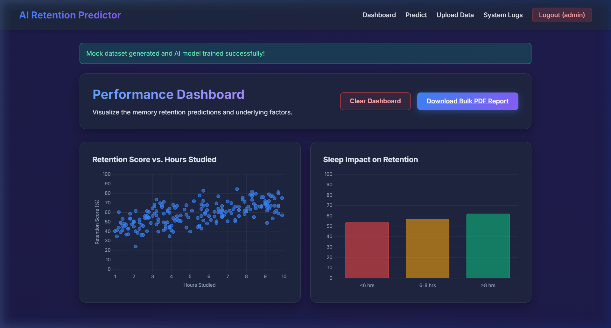
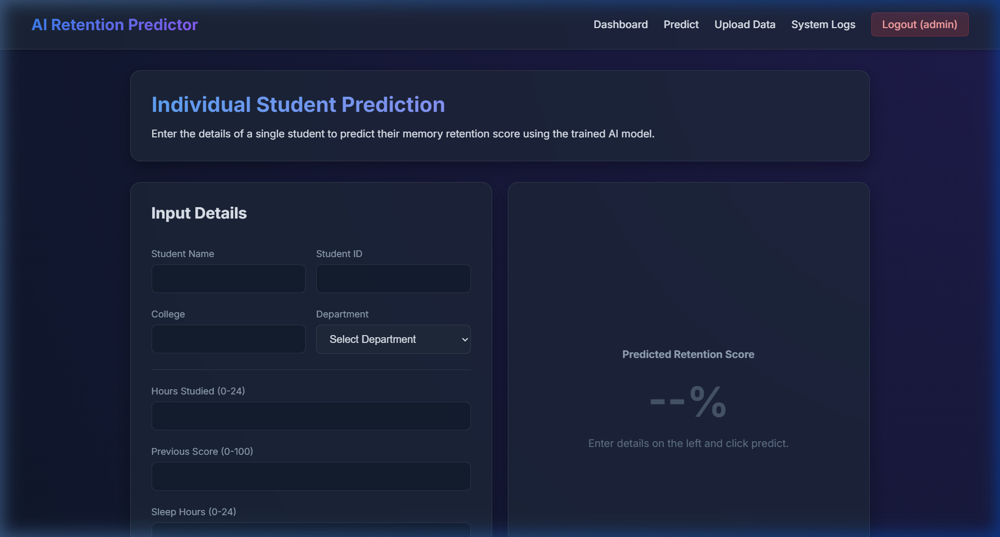
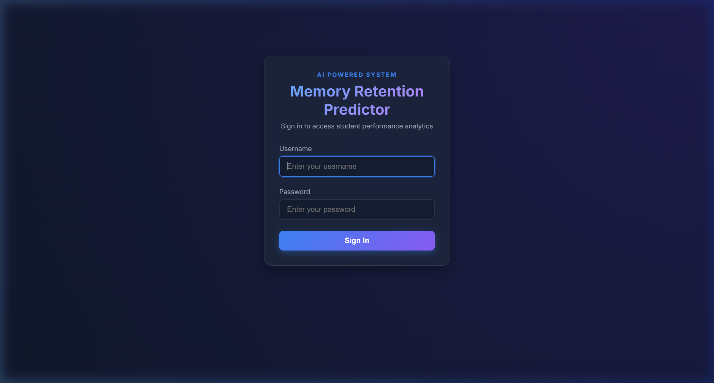
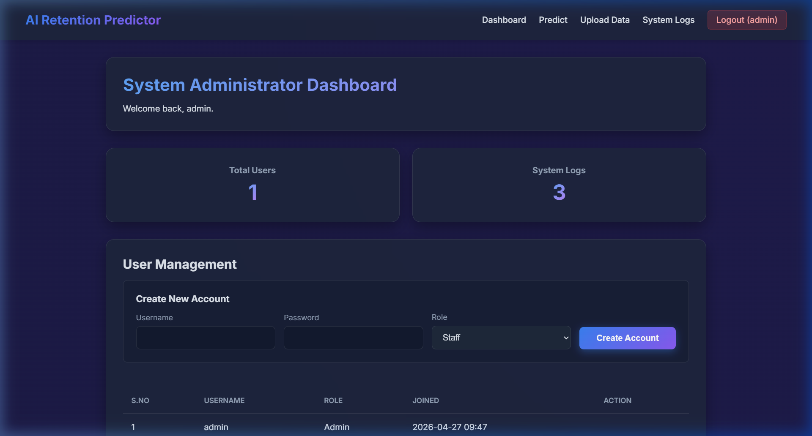

# 🧠 AI-Based Memory Retention Predictor


An intelligent web ecosystem designed to predict student memory retention using advanced machine learning. By analyzing variables such as **study hours**, **sleep duration**, and **academic history**, the system provides actionable insights for educators and students.

---

## 🚀 Key Features

- **🤖 Machine Learning Engine**: Powered by **Random Forest Regression** for high-accuracy retention forecasting.
- **📊 Interactive Analytics**: Real-time data visualization using **Chart.js**, featuring multi-metric comparisons.
- **📁 Data Interoperability**: Seamlessly process bulk data via CSV/Excel uploads with automated field mapping.
- **🛡️ Enterprise Security**: Role-Based Access Control (RBAC) with hashed passwords and detailed system audit logs.
- **📄 Automated Reporting**: One-click PDF generation for individual student profiles and aggregate analytics.

---

## 📸 Screenshots

### 🖥️ Analytics Dashboard
Comprehensive overview of student metrics and AI predictions.


### 🔮 Prediction Interface
Input interface for individual student assessment.


### 🔐 Secure Login
Authentication gateway for authorized personnel.


### 🛠️ Admin Panel
System administration and audit log monitoring.


---

## 🛠️ Architecture & Tech Stack

### Backend Logic
- **Core**: Python / Flask
- **ML Model**: `RandomForestRegressor` (100 estimators)
- **Data Handling**: Pandas & NumPy for vectorization and preprocessing.

### Frontend Experience
- **Styling**: Modern CSS with glassmorphism effects.
- **Interactivity**: Dynamic JavaScript for real-time chart rendering and UI transitions.

### Database Schema
- **SQLAlchemy ORM**: Handles relations between `User`, `StudentRecord`, and `SystemLog`.
- **Relational Integrity**: Foreign key constraints ensure data ownership and logging consistency.

---

## ⚙️ Quick Start

1. **Clone & Install**:
   ```bash
   git clone https://github.com/Poobeshraj-M/AI-Based_Memory_Retention_Predictor.git
   cd AI-Based_Memory_Retention_Predictor
   pip install -r requirements.txt
   ```

2. **Environment Configuration**:
   - Copy `.env.example` to `.env`
   - Configure your `MYSQL_PASSWORD` and other database settings.

3. **Initialize & Launch**:
   ```bash
   python create_db.py  # Create MySQL database
   python app.py       # Start Flask server
   ```

---

## 👤 Project Author

**Poobeshraj M**
- **GitHub**: [@Poobeshraj-M](https://github.com/Poobeshraj-M)
- **Role**: Lead Developer & AI Engineer

---

## 📄 License
This project is licensed under the MIT License - see the [LICENSE](LICENSE) file for details.
